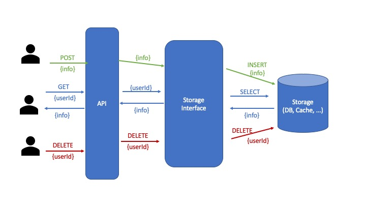

# TRD

## Fonctional needs

### "Page" Endpoint

When on a page, I need to post data about the current page and the user currently viewing it. The data I want to send looks like this :

```json
{
    "user_id": "019mr8mf4r",
    "name": "Pricing Page",
    "timestamp": "2012-12-02T00:30:12.984Z"
}
```

### "User" Endpoint

I want to be able to fetch data bout a specific user id. The data I need to fetch is:

```json
{
    "user_id": "019mr8mf4r",
    "number_pages_viewed_the_last_7_days": 21,
    "time_spent_on_site_last_7_days": 18,
    "number_of_days_active_last_7_days": 3,
    "most_viewed_page_last_7_days": "Blog: better B2B customer experience"
}
```

### "Delete" Endpoint

Delete all info about user `user_id`

## Brainstorming on technical aspects

In the end, we want something like this :

* Page => Insert info in DB
* User => Get info from DB

We want to get info from the last 7 days. So we want to be able to filter the data by date. 

? Only want to get the last 7 days?
* we can clean the "deprecated" data
* we only need a timestamp with the day, not time

### Option 1 - "Cached" option

* when receiving data, store it in a simple cache
* Aggregate from cache when "user" endpoint is called

#### Pros
* Really simple to implement
#### Cons
* Cache is not persisted so we lose data when the service restarts
* If lots of data, memory will be a problem

### Option 2 - "simple database" option

* when receiving info with page endpoint, storing in DB with timestamp
* when "user" is called, filter data according to timestamp and aggregate data

#### Pros
* Simple to implement
* Easy to change the interval if we need to: simply update the filter method, but everything is available in the db
#### Cons
* All the data is stored, so lots of data
* Fetching and filtering all the data might be long
  - we could index the data by day to make the filtering by date quicker, but then filtering on userId?
  - if we index by day, it's still okay for a wider interval, but we'd have to reindex if we want a narrower interval

### Option 3 - "cleaned database" option

* when receiving info with page endpoint, storing in DB with timestamp
* put a TTL of 7 days on data
* when "user" is called, aggregate data

#### Pros
* Simple to implement
* Less data to store
* No need to filter data since only useful data is in the db
#### Cons
* We lose the old data, so if we want to switch to a 1-month interval, at first we'll be missing data

### Option 4 - "event sourcing" option

* when receiving info with the page endpoint, send an event to a kafka bus (for example)
* the kafka bus listens to these events, and then aggregates them in a db
* we can have a daily (or nightly) job to clean the deprecated data from the db (replay events and have a job that does the opposite of the aggregating one)
* when "user" is called, aggregate data from db

#### Pros
* Scalable: if we want to change the interval, we'll simply have to create a one-time bach that replays events and fills (or empties) the db accordingly
* Once again the db only contains the needed info, so less data to store
#### Cons
* More difficult to implement, bigger TTM

## Specs

### Architecture



Storage: Multiple implementations:
* Cache implementation (environment "Production" so that it works correctly on Heroku)
* Simple Cassandra implementation (other environments, connecting to the respective cassandra instances)

### Database schema

#### Cache

Really naive structure for the cache, as its primary goal is really to be the simplest POC possible

UserId => List of all the pieces of information sent relative to this user

#### Cassandra

* Columns : UserId, TimeStamp, PageName
* Primary Key: (UserId, TimeStamp)

With this primary key, we are going to ignore multiple events occuring at the same time, but with the precision of timestamp, it's probably a mistake if two events are sent with the exact same one. Having it as a primary key will allow us to filter more efficiently directly with our requests.

### Time spent on the site

Based on the data in the examples, we are going to return the interval of time the user has spent on the website, in minutes. For that, we are going to consider that in one session on the website, a user spends `LastPage.Time - FirstPage.Time + 1` minutes on the site. We are also considering that if there is more than 30 minutes between two pages, it's a different session.